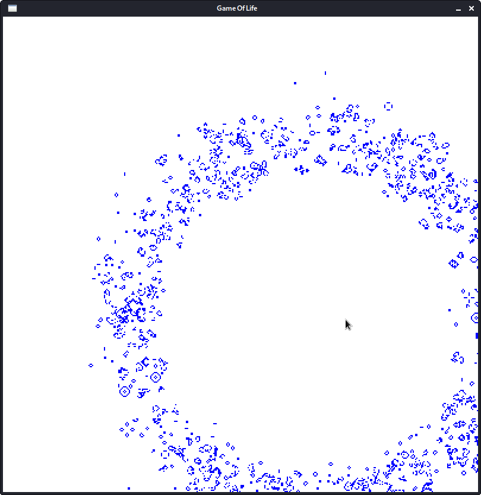
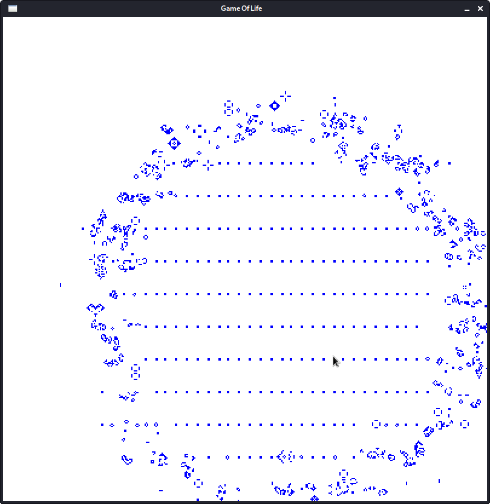
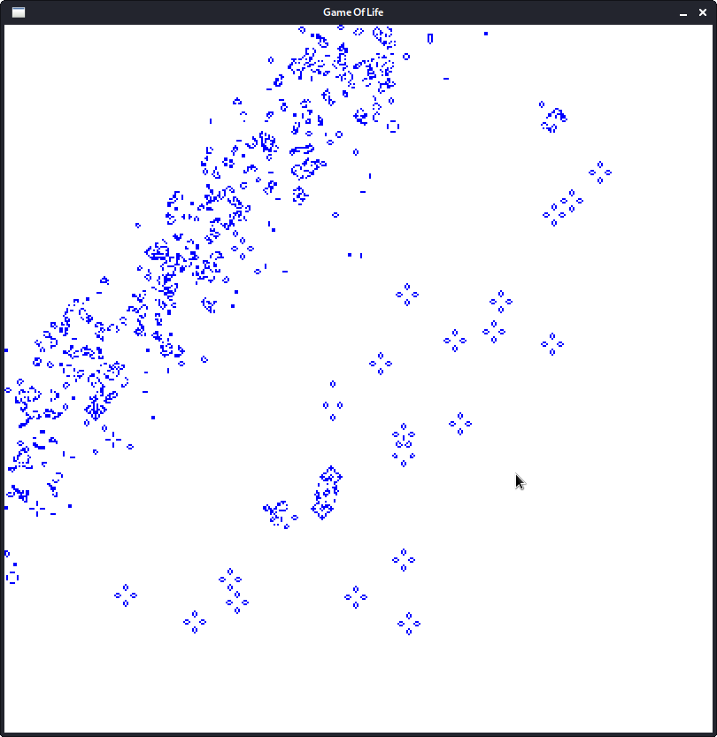
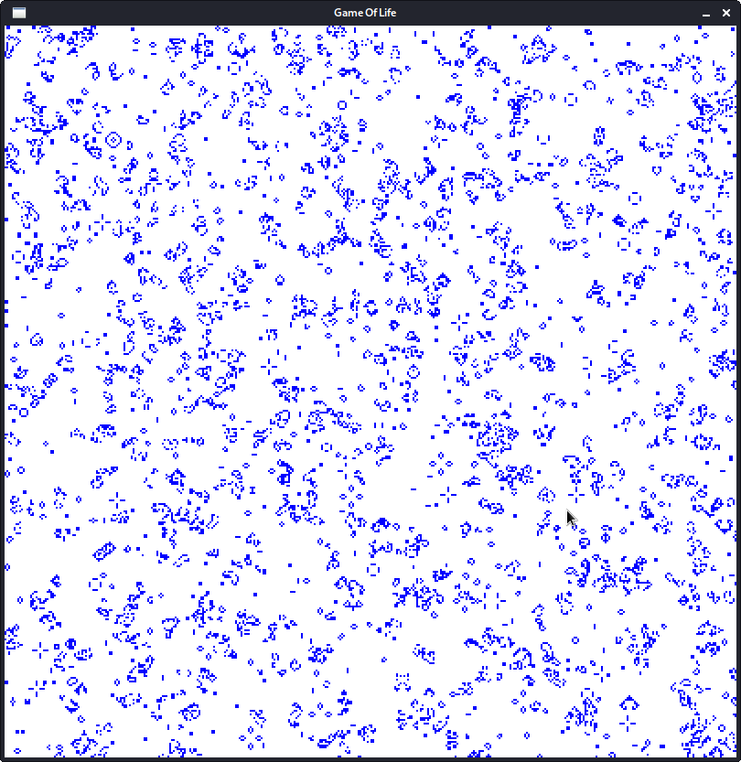

# Game_Of_Life
The Game of Life is a cellular automaton devised by the British mathematician John Horton Conway in 1970: [wikipedia](https://en.wikipedia.org/wiki/Conway%27s_Game_of_Life)

This litte program generates a 2-D Area of cells and initializes the area with active cells.
For the initialization the user can choose 4 different probability distributions. The distribution is set by a single character on the command line as follows:
'n': normal distribution
'b': binomial
'e': exponential
'u': uniform (default if no arg is passed)

Additional parameters such as cell dimensions, number of rows and columns in the cell grid, and the screen resolution must currently be altered in the header files.
Feel free to alter number of initially active cells in function main as well. 

The user can set an area of active cells by clicking the area on the screen.

This project is just to solidify my basic C++ knowledge after doing the great tutorials at [caveofprogramming](https://caveofprogramming.com/)

Some screenshots of the program running:

 Normal

 Binomial

 Exponential

 Uniform
